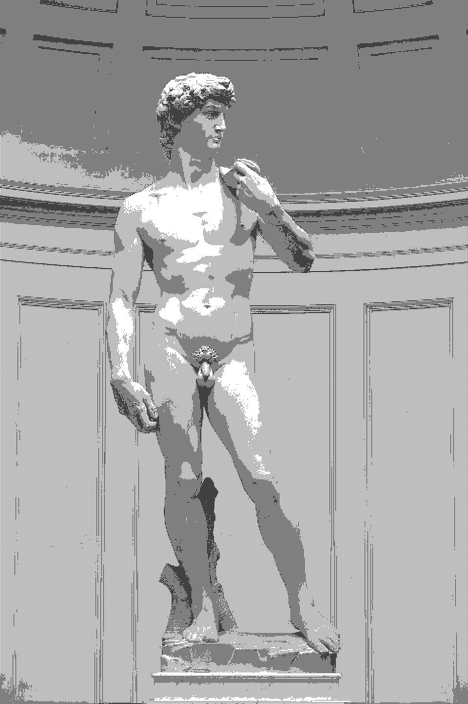
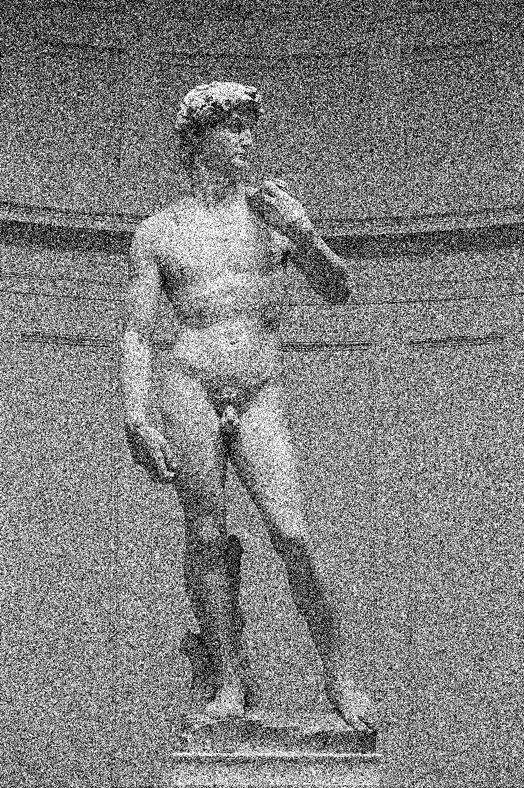

# rust-dither

Simple, terminal-based rust program to perform dithering on images.

Supports:
- Threshold
- Random
- Bayer (2x)
- HalfTone (in-progress)

Algorithms to be added:
- Bayer (4x / 8x)
- Floyd-Steinberg
- Void and Cluster

### Examples
 

### Installation

Clone the repo:
```
git clone https://github.com/luca-thompson/dither.git
```

Install Dependancies and Compile:
```
cargo build
```

### Usage

After having run cargo build,

```
cargo run --f-in <F_IN> --f-out <F_OUT> --algorithm <ALGORITHM>
```

| Arg         | Purpose                                 |
| ----------- | --------------------------------------- |
| --f-in      | file in (image to dither)               |
| --f-out     | file out (dithered image save location) |
| --algorithm | algorithm to use                        |


